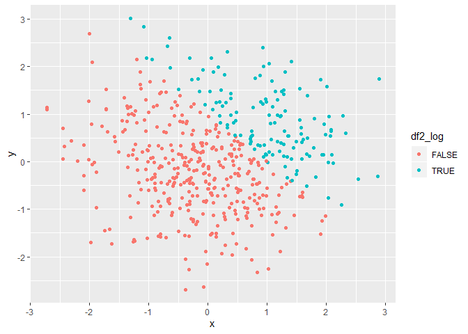
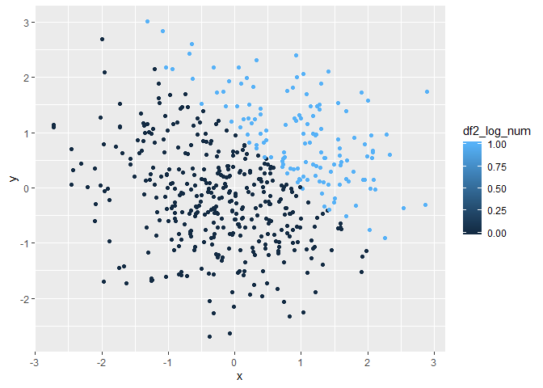
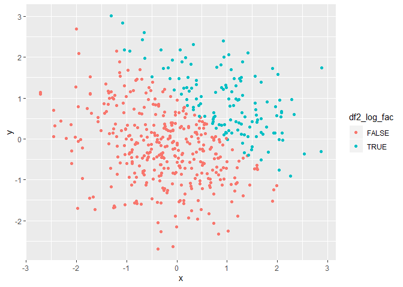

hw1
================
YuaoYang
2019/9/17

Problem 1

``` r
# use tibble to create data frame
library(tidyverse)
```

    ## -- Attaching packages ------------------------------------------- tidyverse 1.2.1 --

    ## √ ggplot2 3.2.1     √ purrr   0.3.2
    ## √ tibble  2.1.3     √ dplyr   0.8.3
    ## √ tidyr   0.8.3     √ stringr 1.4.0
    ## √ readr   1.3.1     √ forcats 0.4.0

    ## -- Conflicts ---------------------------------------------- tidyverse_conflicts() --
    ## x dplyr::filter() masks stats::filter()
    ## x dplyr::lag()    masks stats::lag()

``` r
set.seed(1)
randon_sample = rnorm(8, mean = 0, sd = 1)
logical_vector = randon_sample > 0
character_vector = c("a", "b","c", "d", "e", "f", "g", "h")
factor_vector = factor(c("A", "B", "C", "A", "B", "C", "A", "B"))
example_df1 = tibble(
 randon_sample,
  logical_vector,
  character_vector,
  factor_vector )

#use mean fuction to caculate the mean value
randon_sample_mean = mean(randon_sample)
logical_vector_mean = mean(randon_sample)
character_vector_mean = mean(character_vector)
```

    ## Warning in mean.default(character_vector): argument is not numeric or
    ## logical: returning NA

``` r
factor_vector_mean = mean(factor_vector)
```

    ## Warning in mean.default(factor_vector): argument is not numeric or logical:
    ## returning NA

``` r
#the mean function dose not work on character 
```

``` r
as.numeric(logical_vector)
as.numeric(character_vector )
as.numeric(factor_vector)
# We can find that as.numeric can not work on character.
```

``` r
logical_vector_num = as.numeric(pull(example_df1,logical_vector))
l = logical_vector_num*pull(example_df1,randon_sample)
logical_vector_fac =  as.factor(pull(example_df1,logical_vector))
m = logical_vector_fac*pull(example_df1,randon_sample)
```

    ## Warning in Ops.factor(logical_vector_fac, pull(example_df1,
    ## randon_sample)): '*' not meaningful for factors

``` r
logical_vector_fac_num = as.numeric(logical_vector_fac)
n = logical_vector_fac_num*pull(example_df1,randon_sample)
#Use the as.factor changes logical vector, we get NA. But it works on as.numeric function,TRUE=1, FALSE=0.
```

Problem 2

``` r
#use tibble to create data frame
set.seed(2)
example_df2 = tibble(
  x = rnorm(500, mean=0, sd=1),
  y = rnorm(500, mean=0, sd=1),
  df2_log= x+y > 1,
  df2_log_num = as.numeric(df2_log),
  df2_log_fac = as.factor(df2_log)
)
```

the size of dataset is (500, 5). The mean of x is (0.0616923), the
median is (0.0439172),the standard deviation is (1.0323776). The
proportion of x+y \> 1 is
(0.266)

``` r
ggplot(example_df2, aes(x = x, y = y,  color = df2_log))  + geom_point()
```

<!-- -->

``` r
ggsave("the first scatterplot.pdf" )
```

    ## Saving 7 x 5 in image

``` r
#comment:Red points represent the FALSE, and blue represent TURE. We can find that the blue one is above the red one, because x+y>1, which means blue one >1. We also can find there is like a line to seperate blue and red one which is most appropriate to x+y=1.
ggplot(example_df2, aes(x = x, y =  y,  color = df2_log_num))  + geom_point()
```

<!-- -->

``` r
#comment:The color changed in blue to dark, the darkest one is 0, the ligher blue is 1, because as.numeric change the TRUE to 1, FALSE to 0.We also can find there is like a line to seperate blue and red one which is most appropriate to x+y=1.
ggplot(example_df2, aes(x = x, y =  y,  color = df2_log_fac))  + geom_point()
```

<!-- -->

``` r
#comment:The color distribution is the same as it in the first scatterplot.We also can find there is like a line to seperate blue and red one which is most appropriate to x+y=1.
```
